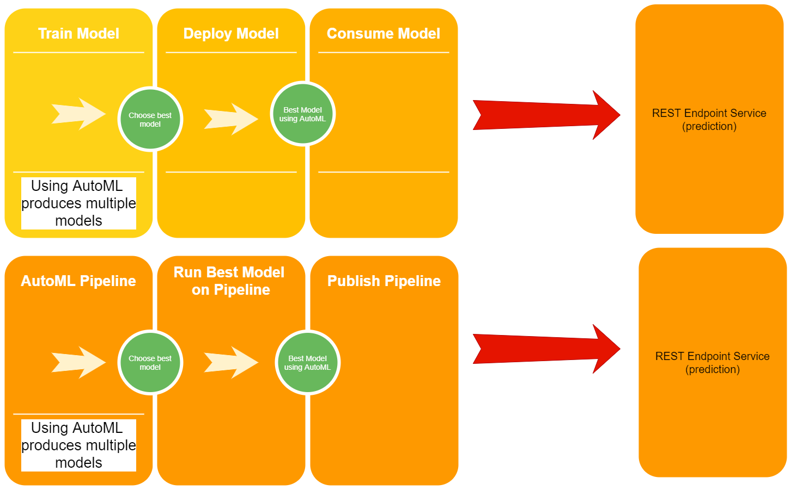

# Azure Nanodegree - Project 2: Operationalizing Machine Learning

*Overview:* For this project, we use the Bank Marketing dataset that contains data on customers. The goal is to predict whether a particular bank customer will subscribe to a deposit using Machine Learning. To solve this problem, we use classification. We first train a model, deploy and then consume it. Then we create an ML pipeline and configure and publish endpoints.

The first part of the project was run using Azure ML Studio. The second part was using Jupyter Notebook. 

## Architectural Diagram

*Explanation*: Below is an architectual diagram of the project. It has two parts. In the 1st part, autoML is used, after which the best model is selected, deployed and whose endpoints are consumed. In the second part, an ML piepline is created using Jupyter notebook. It takes the dataset and uses AutoMLStep to create and publish a pipeline with a REST endpoint. 

## Key Steps

*Phase 1* has the following sub-steps: 

- Run AutoML

- Choose the best model

- Deploy it enabling application insights
 
- Produce log files running the logs.py file

- Running Swagger Documentation

- Consume Model Endpoint

*Phase 2*: The second part has the following steps : 

- Import dependencies and initialize workspace

- Create/use the dataset

- Train the data

- Choose the best model

- Create pipeline

## Part 1 - Model Training & Deployment & Consumption:

- Run AutoML - This consists of the following steps:

- Uploading the bank marketing dataset

 

- Successful completion of the AutoML experiment

 

- Choosing the best model based on the accuracy metric
	The best model uses the algorithm 'VotingEnsemble'

 

- Deploy the best model enabling application insights
 

- Produce logs by running logs.py file
 

- Running swagger documentation
 

 

- Consume model endpoint by using the script 'endpoint.py'; a request is made to the deployed model for 2 data points, after which a response is gnerated

 

## Phase 2 -  Key Steps

- Created pipelines

 

- Active pipeline endpoint

 
- Published endpoint with details
 

- Scheduled run
 

## Screen Recording
*Youtube Link* -  - This is a minute video [screencast](https://youtu.be/En3n4NFd_kQ) of my going through the screenshots and the flow of the project. 

## Future Improvements 

1- Input Data Enhancements - The columns of the dataset could be worked on to improve the model performance. The same can be done for AutoMLConfig settings used for the Automated ML Run in part 1. 
 
2- ONNX - Ideally, models should have ONNX support.

3- I think for both phases, a more powerful compute cluster could be chosen to speed up the process.

