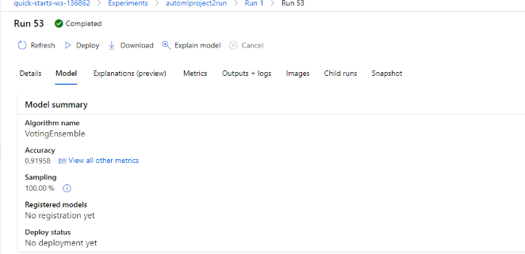

# Azure Nanodegree - Project 2: Operationalizing Machine Learning

*Overview:* For this project, we use the Bank Marketing dataset that contains data on customers. The goal is to predict whether a particular bank customer will subscribe to a deposit using Machine Learning. To solve this problem, we use classification. We first train a model, deploy and then consume it. Then we create an ML pipeline and configure and publish endpoints.

The first part of the project was run using Azure ML Studio. The second part was using Jupyter Notebook. 

## Architectural Diagram

*Explanation*: Below is an architectual diagram of the project. It has two parts. In the 1st part, autoML is used, after which the best model is selected, deployed and whose endpoints are consumed. In the second part, an ML piepline is created using Jupyter notebook. It takes the dataset and uses AutoMLStep to create and publish a pipeline with a REST endpoint. 

## Key Steps

*Phase 1* has the following sub-steps: 

- Run AutoML

- Choose the best model

- Deploy it enabling application insights
 
- Produce log files running the logs.py file

- Running Swagger Documentation

- Consume Model Endpoint

*Phase 2*: The second part has the following steps : 

- Import dependencies and initialize workspace

- Create/use the dataset

- Train the data

- Choose the best model

- Create pipeline

## Part 1 - Model Training & Deployment & Consumption:

- Run AutoML - This consists of the following steps:

- Uploading the bank marketing dataset: we chose the bank marketing dataset for this project, which includes data on customers. It was provided to us; we had to use the link and download it to our computer to upload it to Azure ML workspace.

  

- Successful completion of the AutoML experiment: the screenshot below shows the successful completion of the AutoML run that used the dataset we uploaded in the first step.

  

- Choosing the best model based on the accuracy metric: our primary metric was accuracy. The best model uses the algorithm 'VotingEnsemble', which is a combination of multiple models. The best model had an accuracy of approximately 0.92.

   

- Deploy the best model enabling application insights: in this step, we deployed the best model that we produced in the previous step and enabled authentication for deployment, using Azure Container Instance (ACI). Once the deployment is over, we see a screen that says application insights enabled.

  

- Produce logs by running logs.py file: the code in this file enables application insights, which is disabled before executing logs.py

 
 
- Running swagger documentation:  There are two files: SwaggerSH and serve.py. In this step, swagger shows the HTTP API methods and responses for the model.

  
 
  
 
  
 
   

- Consume model endpoint by using the script 'endpoint.py'; a request is made to the deployed model for 2 data points, after which a response is generated

  

## Phase 2 -  Key Steps

- Created pipelines: Using the code in Jupyter Notebook, we created a pipeline in Azure workspace and checked the pipelines section to make sure it was created

  

- Active pipeline endpoint: the screenshot below shows the pipeline endpoint as active

  
 
  
 
- Published endpoint with details: the screenshot shows the details of the endpoint. It shows the status, active, and the link for REST endpoint, as well as giving a picture of the run in the Designer workspace.

 

 
- Scheduled run
 
 

## Screen Recording
*Youtube Link* -  - This is a minute video [screencast](https://www.youtube.com/watch?v=715erJpk1YE&feature=youtu.be) of my going through the screenshots and the flow of the project. 

## Future Improvements 

1- Input Data Enhancements - The columns of the dataset could be worked on to improve the model performance. The same can be done for AutoMLConfig settings used for the Automated ML Run in part 1. 
 
2- ONNX - Ideally, models should have ONNX support so that the range of environments used could be expanded.

3- I think for both phases, a more powerful compute cluster could be chosen to speed up the process, as I did spend some time on the autoML part. 

